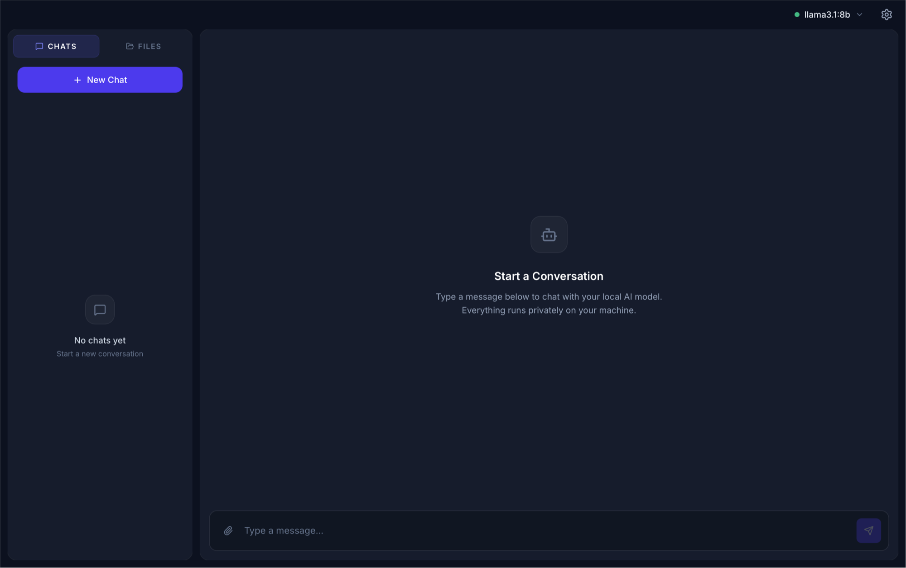
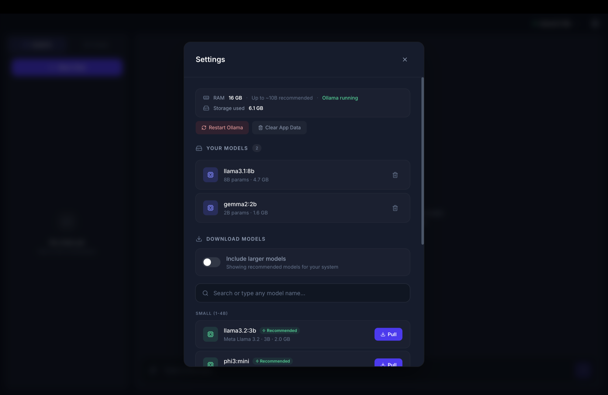

  

<h1 align="center">InnerTalk AI</h1>

  A private, offline desktop app for chatting with local AI models. 
  Powered by <a href="https://ollama.com">Ollama</a> — no setup, no cloud, no API keys.

  
  

  

---

## Features

- **100% Private** — everything runs locally, no cloud
- **Multiple Models** — download and switch between models
- **Chat History** — conversations persist across restarts
- **File Context** — attach files and folders as context
- **Streaming** — real-time responses with markdown and code blocks

  

---

## Installation

1. Download the latest `.dmg` from [Releases](https://github.com/JoFaTech2508/innertalk-ai/releases)
2. Open the `.dmg` and drag the app to Applications
3. Launch the app — Ollama is bundled, no separate install needed

### Requirements

- macOS 12 or later (Apple Silicon or Intel)
- 8 GB RAM minimum (16 GB+ recommended for larger models)

---

  Built with <a href="https://v2.tauri.app">Tauri</a>, <a href="https://react.dev">React</a>, and <a href="https://ollama.com">Ollama</a>

© 2026 JoFaTech2508

